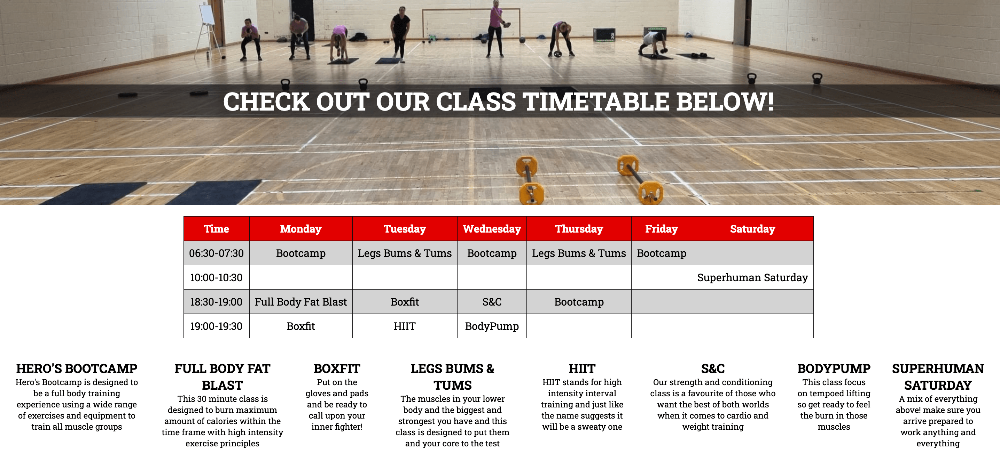

# Heros Gym

The Heros Gym website is designed to give potential members an overview of the gym and what we are all about! Heros Gym offers “big gym” state of the art equipment and classes but with a “small gym” welcoming and encouraging atmosphere.

Using this website you will be able to find all relevant information about the gym including opening and closing times, the class timetable and descriptions of the classes we teach and a gallery showcasing the gym layout and equipment available. There is also a form section where potential members can register their interest and will be sent membership pricing.

## Features

### Navigation Bar & Header Section

- Located at the top of the page, the navigation bar & header section shows the gym company logo on the left hand side and the other naviagtion links to the right.
- The Navigation links are, HOME, TIMETABLE, GALLERY, and SIGNUP
- When displayed on desktop, laptop or tablet screens all naviagtion links are visable but when displayed on a phone screen the links are hidden behind a Nav button which shows all these links in a dropdown menu.
- This section allows all users to naviagte the webiste without the use of the back button.

### Footer

- Located at the bottom of all pages on the webiste is the footer which is styled in red with white social media icons which link to Facebook, Youtube, and Instagram.
- All social media icons when clicked or touched will open in a new tab to the correct site.

### Home Page

- The home page, and all other pages are styled using the same colours that are used in the company logo which are white/gray, black and red.
- The top of the page contains a heading of the gym name "Hero's Gym" and the gym tagline of "Are you ready to become your own Hero?"
- Underneath this we have the main image on this page of the gym owner posing on the ground floor of the gym and some text outlining the gyms three step approach to ensure its members make progress.
- This allows any visitor of the website to get the company ethos right away.
- Below this section we have added the gym opeining and closing times and the address and contact info.
- The last feature on this page just above the footer section is a Google Map showing the gym location.

### Timetable Page

- The Timetable page is the second Nav link in the Nav bar.
- This page has a main image of a gym class in progress at the top of the page with a page heading placed in the center of the image.
- Below the image and the heading we have the full weekly gym class timtable which is coded as a table styled in red, white and gray which shows the name of the gym classes, the times they start, how long they run for and the days in which the classes take place.
- When viewing this page on a mobile screen the table is set to side scroll so it does not distort the layout of the page.
- Below the timetable is a detailed description of all the classes which allows the user of the webste to get an idea of how the class is taught.
- On larger screens this class description is displayed in a column style while viewing this page on tablet and mobile will show in rows.

### Gallery Page

- The gallery page allows the webiste user to see how the gym is layed out, the overall size of the ground floor and first floor, and pictures of the equipment in the gym.
- A picture speaks a 1000 words so other then the heading on this page there is no other text.
- Depending on screen size the images will arrange themselves into 1, 2, or 4 columns.