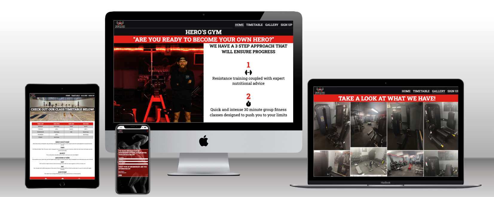
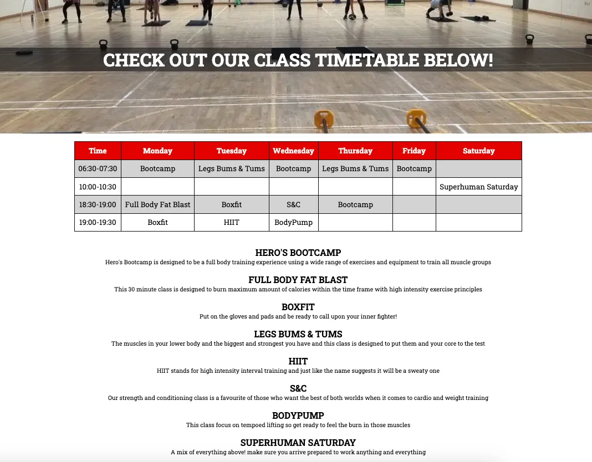
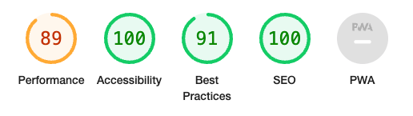

# Heros Gym

The Heros Gym website is designed to give potential members an overview of the gym and what we are all about! Heros Gym offers “big gym” state of the art equipment and classes but with a “small gym” welcoming and encouraging atmosphere.

Using this website you will be able to find all relevant information about the gym including opening and closing times, the class timetable and descriptions of the classes we teach and a gallery showcasing the gym layout and equipment available. There is also a form section where potential members can register their interest and will be sent membership pricing.

## Features

### Navigation Bar & Header Section

- Located at the top of the page, the navigation bar & header section shows the gym company logo on the left hand side and the other navigation links to the right.
- The Navigation links are, HOME, TIMETABLE, GALLERY, and SIGNUP
- When displayed on desktop, laptop or tablet screens all navigation links are visible but when displayed on a phone screen the links are hidden behind a Nav button which shows all these links in a dropdown menu.
- This section allows all users to navigate the website without the use of the back button.

### Footer

- Located at the bottom of all pages on the website is the footer which is styled in red with white social media icons which link to Facebook, Youtube, and Instagram.
- All social media icons when clicked or touched will open in a new tab to the correct site.

### Home Page

- The home page, and all other pages are styled using the same colours that are used in the company logo which are white/grey, black and red.
- The top of the page contains a heading of the gym name "Hero's Gym" and the gym tagline of "Are you ready to become your own Hero?"
- Underneath this we have the main image on this page of the gym owner posing on the ground floor of the gym and some text outlining the gyms three step approach to ensure its members make progress.
- This allows any visitor of the website to get the company ethos right away.
- Below this section we have added the gym opening and closing times and the address and contact info.
- The last feature on this page just above the footer section is a Google Map showing the gym location.

### Timetable Page

- The Timetable page is the second Nav link in the Nav bar.
- This page has a main image of a gym class in progress at the top of the page with a page heading placed in the center of the image.
- Below the image and the heading we have the full weekly gym class timetable which is coded as a table styled in red, white and grey which shows the name of the gym classes, the times they start, how long they run for and the days in which the classes take place.
- When viewing this page on a mobile screen the table is set to side scroll so it does not distort the layout of the page.
- Below the timetable is a detailed description of all the classes which allows the user of the website to get an idea of how the class is taught.

### Gallery Page

- The gallery page allows the website user to see how the gym is layed out, the overall size of the ground floor and first floor, and pictures of the equipment in the gym.
- A picture speaks a 1000 words so other than the heading on this page there is no other text.
- Depending on screen size the images will arrange themselves into 1, 2, or 4 columns.

### Signup Page

- The last page on the website is the signup page. Here users are asked to enter some basic contact info and to choose which membership option they are interested in and submit a request to join the gym.

### Thank You Page

- When a user of the site completes the form on the sign up page and hits submit they will be redirected to the thank you page which confirms the form submission has been succesful and after 10 secounds they will be automatically taken back to the webiste homepage.

### 404 Error Page

- A custome 404 page will be implemented and will display if a user navigates to a broken link.
- The 404 page will allow the webiste user to navigate back to the homepage if they end up on a broken link / missing page, without the need of the browsers back button.

## Technologies

- HTML
  - The webpage structure was created using HTML as the main language.
- CSS
  - The styling of the webiste was done using custom CSS saved in an external file.
- IDE
  - The website was developed using Codeanywhere IDE.
- Github
  - The source code is hosted on Github and deployed using Git Pages.
- Git
  - Git was used to commit and push code during the project.
- Favicon.io
  - Favicon files were created at [favicon.io](https://favicon.io/favicon-converter/)

## Testing

- I have tested the webpage across all different screen sizes, desktop, laptop, tablet and mobile and it is responsive and functions as intended.
- All links work as intended and open in new tabs were required.
- All text is readable and the contrast between text colours and background works well and causes no issues.
- I have confirmed that the form on the signup page works, all text and radio buttons require an input and the email address box requires a valid email address format.

### Bugs

- When using validation tools I discovered that the image file paths had blank spaces which needed to be filled with "%20".

### Validator Testing

- HTML: No errors were returned when passing through the official [W3C Validator](https://validator.w3.org/nu/#textarea)
- CSS: No errors were returned when passing through the official [Jigsaw Validator](https://jigsaw.w3.org/css-validator/validator)
- Accessibility: I confirmed that the colours and fonts chosen are easy to read and accessible by running it through lighthouse in Dev Tools.

## Deployment

- The site was deployed to GitHub pages.
- In the GitHub repository, navigate to the Settings tab.
- From the source section drop-down menu, select the Master Branch.
- Once the master branch has been selected, the page will be automatically refreshed with a detailed ribbon display to indicate the successful deployment.

The link to the live site can be found here: [Heros Gym](https://defridge.github.io/HerosGym-P1-A2/)

## Credits

### Content

- The code for the footer section using the social media icons were taken from the CI Love Running project.
- The code to style the table for the Timetable page was taken from [w3schools](https://www.w3schools.com/css/css_table.asp)

### Images

- All images used for the website were taken by myself.